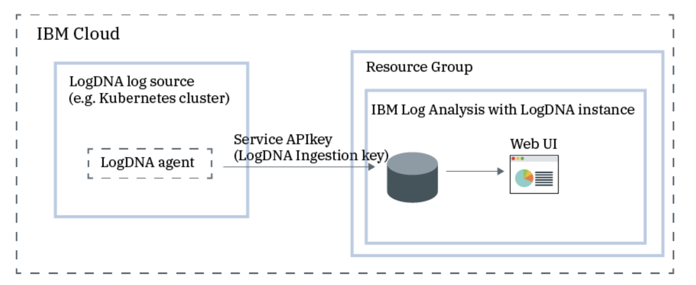
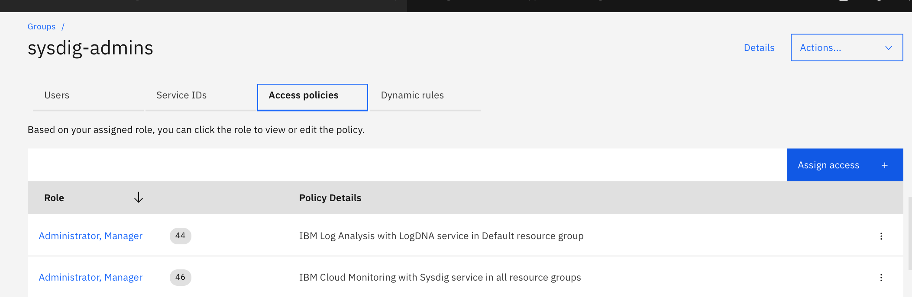
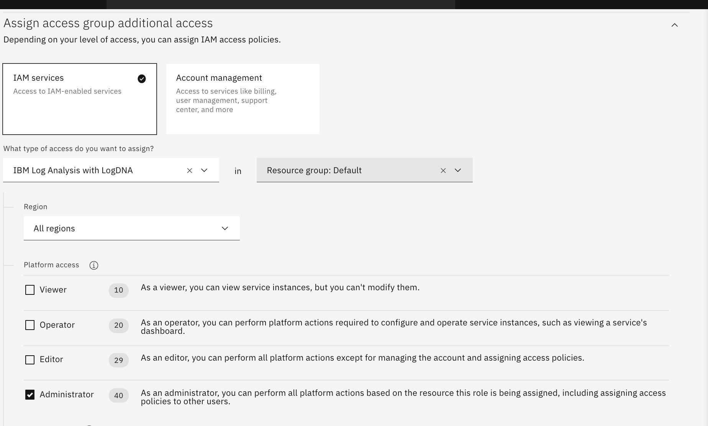

# Logging in IBM Cloud by using IBM Log Analysis with LogDNA

IBM Log Analysis with LogDNA is a co-branded service that you can include as part of your IBM Cloud architecture to add log management capabilities. IBM Log Analysis with LogDNA is operated by LogDNA in partnership with IBM.
You can use IBM Log Analysis with LogDNA to manage system and application logs in IBM Cloud.

The following figure shows the components overview for the IBM Log Analysis with LogDNA service that is running on IBM Cloud:
## Objectives

The different sections in this part of the lab will show you how to:
 Assign LogDNA access policy to user 
 Provision the IBM Log Analysis with LogDNA service 
 Configure a Kubernetes cluster so that you can monitor its logs by using the IBM Log Analysis with LogDNA service 
 Launch the LogDNA web UI from where you can monitor and manage your logs 
 Explore the LogDNA web to learn about the different sections 

### Assign LogDNA access policy to user
#### Go to Manage->Access(IAM)->Access Group 
Click on access group we created (sysdig-admin) and go to access policy page

Add IBM Cloud Log Analysis using LogDNA access . and add Adminitrator permission

     
  
     
### Provision the IBM Log Analysis with LogDNA service

     
     
