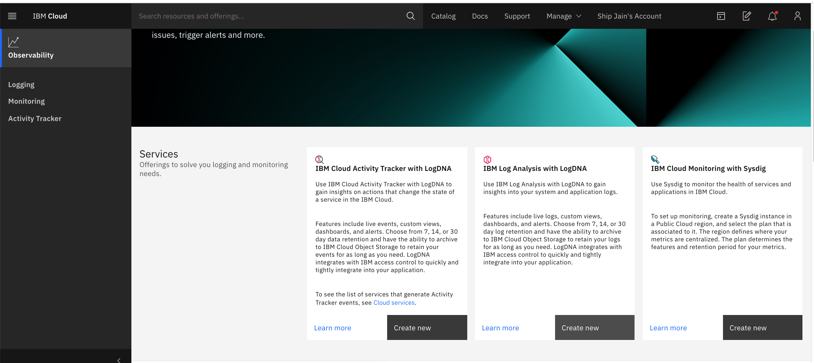
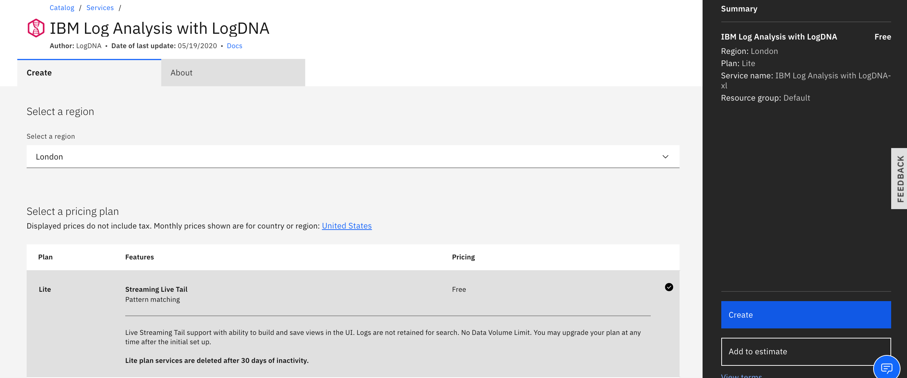
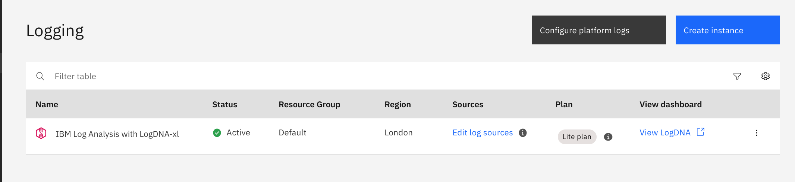
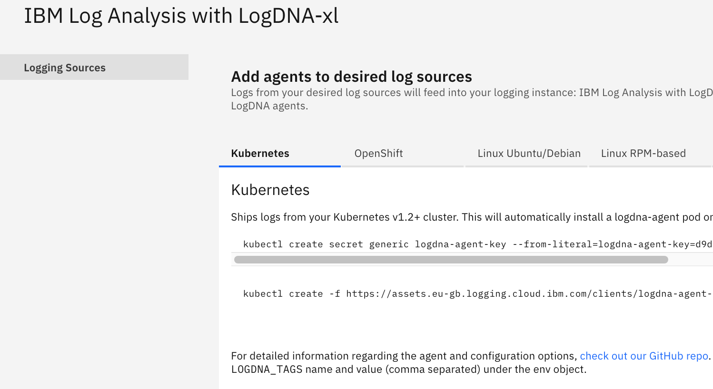
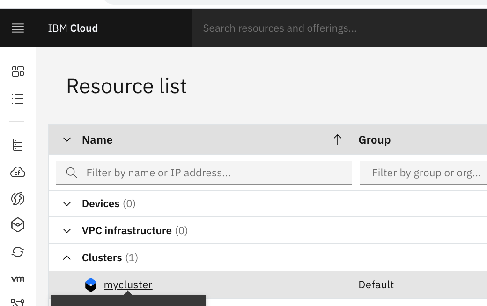
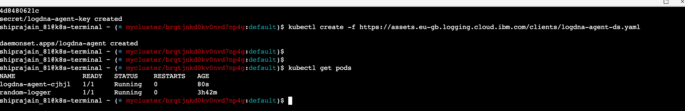
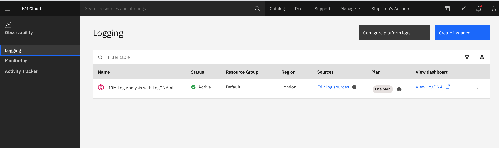
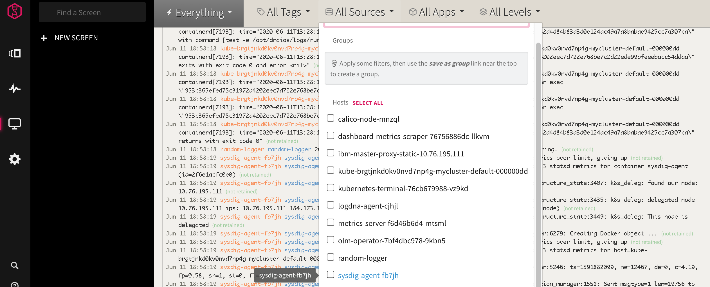

# Logging in IBM Cloud by using IBM Log Analysis with LogDNA

IBM Log Analysis with LogDNA is a co-branded service that you can include as part of your IBM Cloud architecture to add log management capabilities. IBM Log Analysis with LogDNA is operated by LogDNA in partnership with IBM.
You can use IBM Log Analysis with LogDNA to manage system and application logs in IBM Cloud.


The following figure shows the components overview for the IBM Log Analysis with LogDNA service that is running on IBM Cloud:
## Objectives

The different sections in this part of the lab will show you how to:
<br>Assign LogDNA access policy to user</br>
<br>Provision the IBM Log Analysis with LogDNA service</br>
<br>Configure a Kubernetes cluster so that you can monitor its logs by using the IBM Log Analysis with LogDNA service</br>
<br>Launch the LogDNA web UI from where you can monitor and manage your logs</br>
<br>Explore the LogDNA web to learn about the different sections</br>

### Assign LogDNA access policy to user
#### Go to Manage->Access(IAM)->Access Group 
Click on access group we created (sysdig-admin) and go to access policy page

Add IBM Cloud Log Analysis using LogDNA access . and add Adminitrator permission


     
  
     
### Provision the IBM Log Analysis with LogDNA service

From Bavigation->observability, Select LogDNA and create an instance for IBM Log Analysis with
Click IBM Log Analysis with LogDNA. 
 
     
Select Create instance.

Enter a name for the service instance and a location.

Select the resource group that your cluster is in. By default, the Default resource group is set for you.

Choose a service plan for your service instance. By default, the Lite plan is selected for you. For more information about other service plans, see Pricing plans.


     
 
     
#### Get Ingestion keys
Edit Log Sources. This will give you commands to be executed on kubernetes cluster. Copy both the commands and keep it on notepad to be used lated
 


### Configure a Kubernetes cluster so that you can monitor its logs by using LogDNA
Go to Navigation ->Kubernetes -> open web terminal

 


type the commands you have copied in previous step


Check pod installtion by using command ``` kubectl get pods```



    
### Launch the LogDNA web UI from where you can monitor and manage your logs
Go to Observability->Logging



Click on View LogDNA 
Note : for Logs , execute this command on kubernetes web terminal. This app will keep adding logs 
```kubectl run random-logger --image=chentex/random-logger --generator=run-pod/v1```



