# IBM-Cloud-Monitoring-Sysdig

IBM Cloud Monitoring with Sysdig is a co-branded cloud-native, and container- intelligence management system that you can include as part of your IBM Cloud architecture. Use it to gain operational visibility into the performance and health of your applications, services, and platforms. It offers administrators, DevOps teams, and developers full stack telemetry with advanced features to monitor and troubleshoot performance issues, define alerts, and design custom dashboards. IBM Cloud Monitoring with Sysdig is operated by Sysdig in partnership with IBM.
The following diagram shows the components overview for the IBM Cloud Monitoring with Sysdig service that is running on IBM Cloud:


## Objectives
<br>The different sections in this part of the lab will show you how to:</br>
<br>Provision the IBM Cloud Monitoring with Sysdig service.</br>
<br>Configure a Kubernetes cluster so that you can monitor its health and performance by using the IBM Cloud Monitoring with . Sysdig service.</br>
<br>Launch the Sysdig web UI from where you can monitor and manage your environments.</br>
<br>Monitor an application that is running in a cluster.</br>
<br>Define an alert to notify you about errors.</br>

## Pre-Requisites
<br>IBM Cloud Account.</br>
<br>IBM Cloud CLI installtion : - curl -sL https://ibm.biz/idt-installer | bash.</br>
<br>IBM Cloud Kubernetes cluster previsioned.</br>

### 1. Provision the IBM Cloud Monitoring with Sysdig service
Before creating the Sysdig Service , we need to define user and groups which will have access to sysdig dashboard

#### a. Create Access Group

Go to Manage->IAM Account
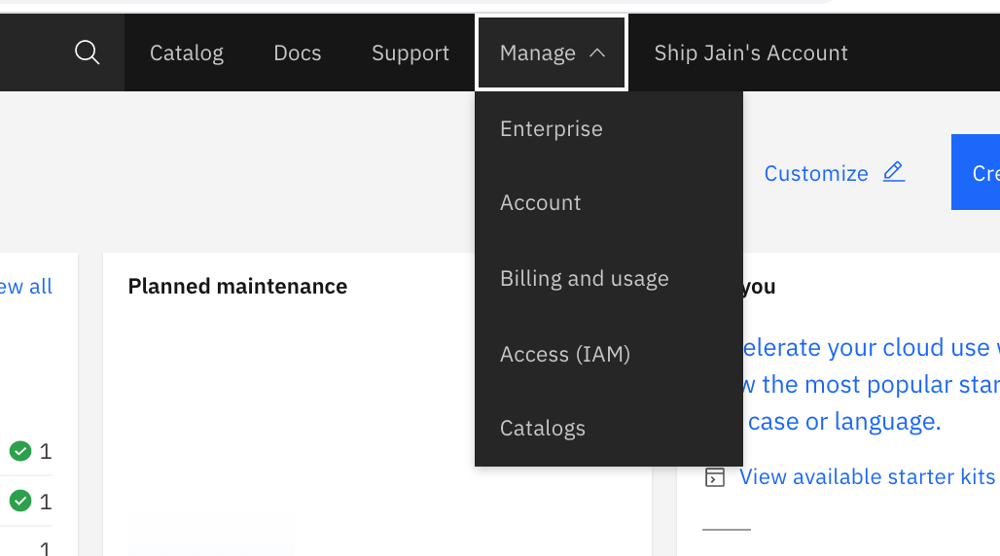


Select Access group from left hand side menu and click create
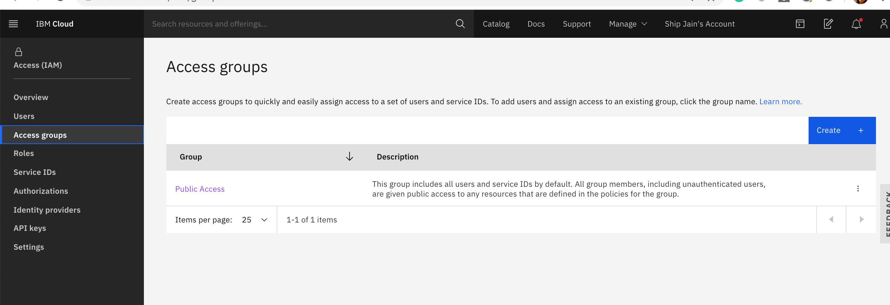


Enter the name of the access group: sysdig-admins


Once the group is created , you will land on add user page. Click on add user and select your user to add it on Access group we have created.
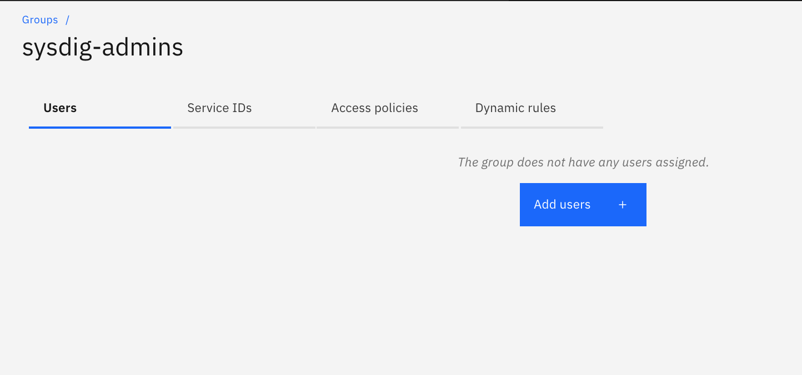


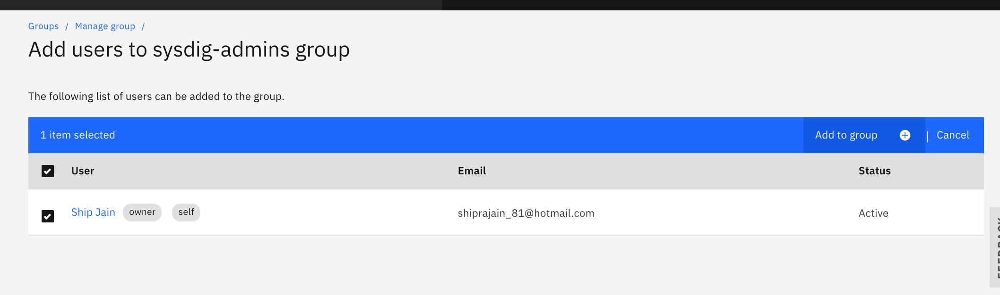


#### b. Add access policy to the user , which is going to use Sysdig for monitoring

Go to access policy tab and click on add access
Select IAM service, and in what type of access do you want , select ibmcloud monitoring with sysdig. Select resource group as default. Provide adminirtator and Manger permission and click on add
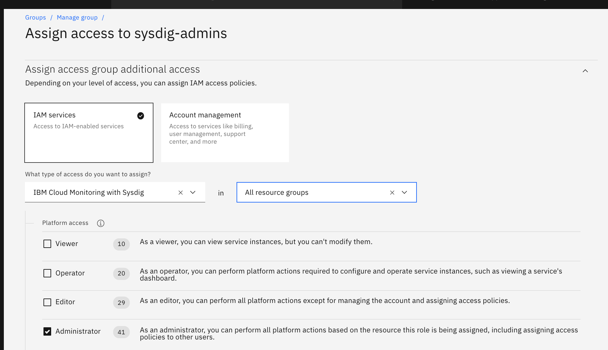

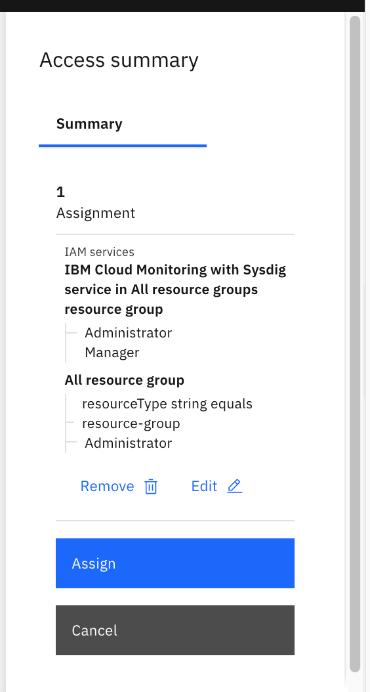


Now add access policy to user . Go to Manage->Access (IAM) ->User. Select your user and from three dots on right side , select assign access
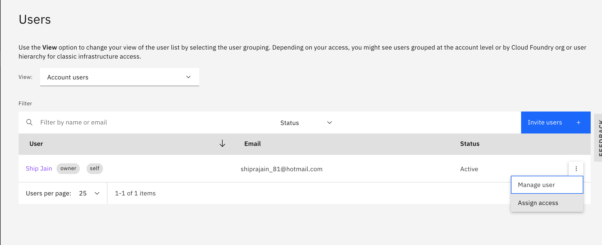

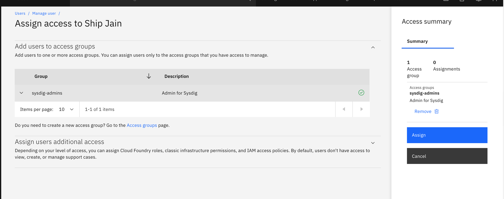

#### c. Create Sysdig Instance
From navigation menu , go to Obsevability and Click on Monitoring

	 Click on create Monitoring instance 
   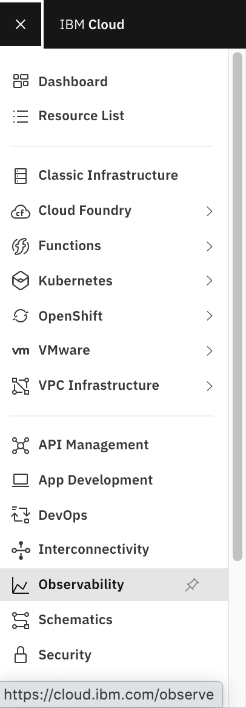

   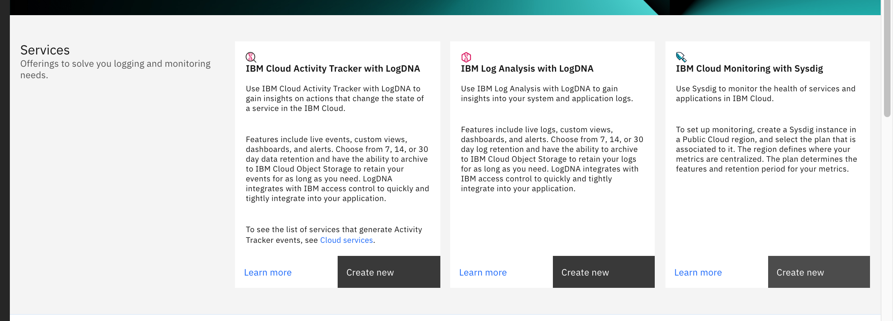

Provide a service name 

##### Please make sure the region is same as your kubernetes cluster region and click on create. Enable service monitoring at the bottom 
   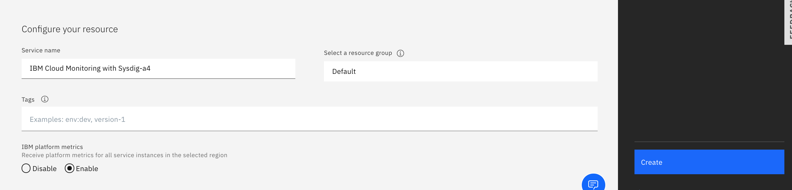
 
 
  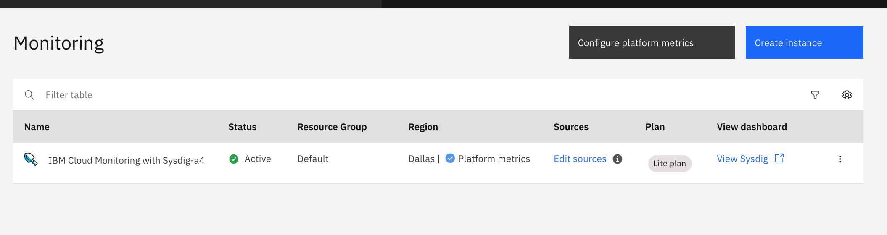
 
  
  Once the instance is created , copy the key which we will use to connect in kubernetes 
    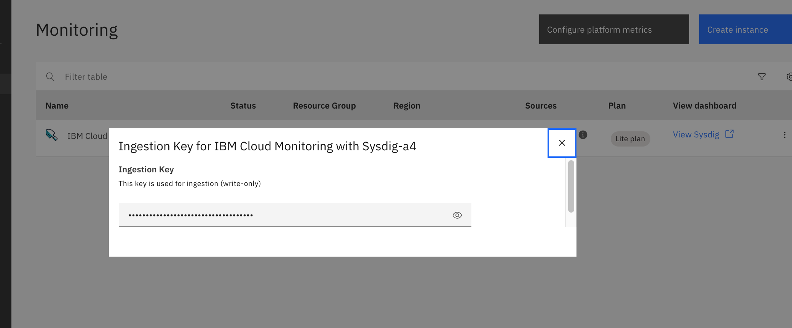
 
 
 Get Sysdig endpoint  using 
 
 https://cloud.ibm.com/docs/Monitoring-with-Sysdig?topic=Monitoring-with-Sysdig-endpoints#endpoints_ingestion 
 
 
 ### 2. Provision Kubernetes cluster
 
 #### a. If not done already please create Kubernetes cluster . It will Take around 20 minutes to provision the cluster
 
 ### 3. Configure a Kubernetes cluster so that you can monitor its health and performance by using the IBM Cloud Monitoring with Sysdig service
 
 #### Connect to IBM Cloud using CLI
 From the navigation menu , go to kubernetes . Click on 3 dots and use connect via cli option . 
 
 Click on Access to login to cluster 
 ``ibmcloud login``
 ``ibmcloud ks cluster config --cluster <cluster_name_or_ID>``
 #### Deploy the Sysdig agent. Run the following command:
 ``curl -sL https://raw.githubusercontent.com/draios/sysdig-cloud-scripts/master/agent_deploy/IBMCloud-Kubernetes-Service/install-agent-k8s.sh | bash -s -- -a SYSDIG_ACCESS_KEY -c COLLECTOR_ENDPOINT -t TAG_DATA -ac 'sysdig_capture_enabled: false'``
 SYSDIG_ACCESS_KEY is the ingestion key for the instance that you previously retrieved.

COLLECTOR_ENDPOINT is the ingestion URL for the region where the monitoring instance is available that you previously retrieved.

TAG_DATA are comma-separated tags that are formatted as TAG_NAME:TAG_VALUE. You can associate one or more tags to your Sysdig agent. For example: role:serviceX,location:us-south. Later on, you can use these tags to identify metrics from the environment where the agent is running.

#### Verify that Sysdig agent installed properly
```kubectl get pods -n ibm-observe```

### Launch the Sysdig web UI from where you can monitor and manage your environments.

Log in to your IBM Cloud account
From the menu External link icon, select Observability.

Select Monitoring. The list of instances that are available on IBM Cloud is displayed.

Find your instance and click View Sysdig.

First time: Because you already installed the Sysdig agent, you can skip through the installation wizard, get started, and complete the onboarding.

Subsequent times: The Explore view opens.

 
  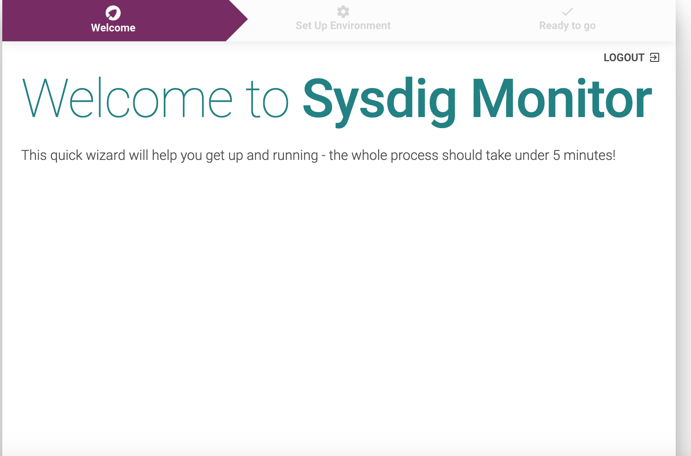
     
   Click Next
     
   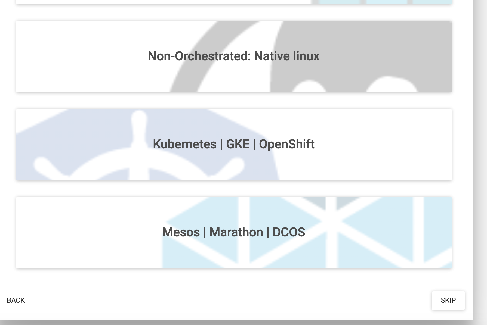
     
   You can skip as we have already installed agent 
   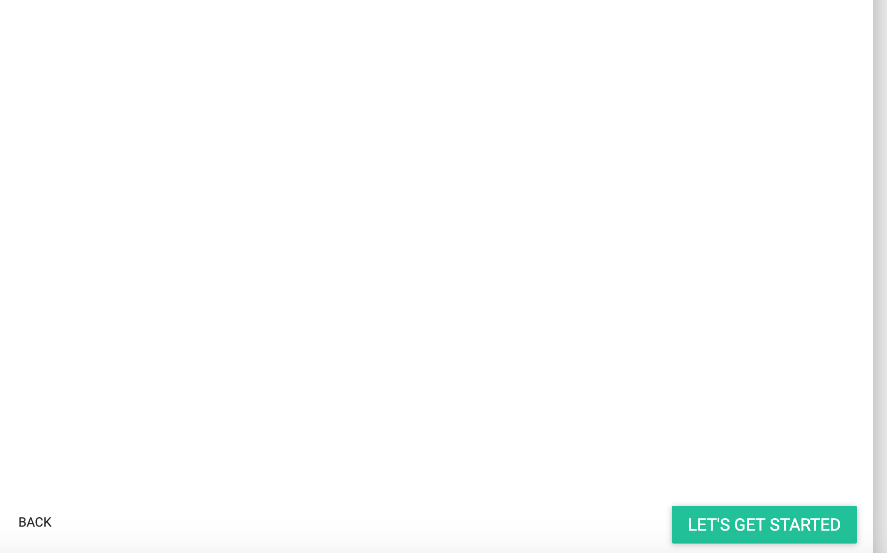
     
   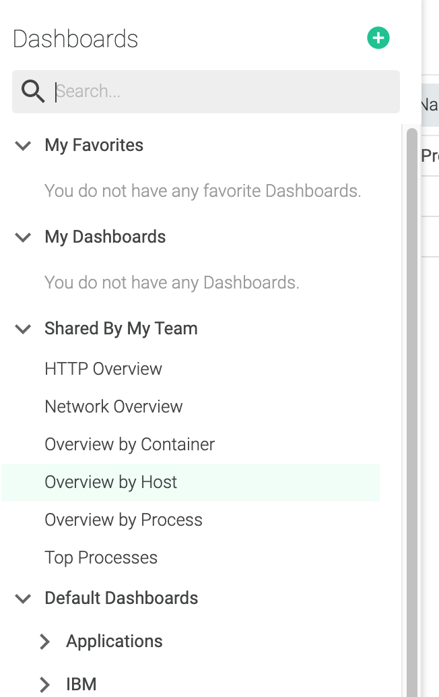
     
  Check the dashabor
  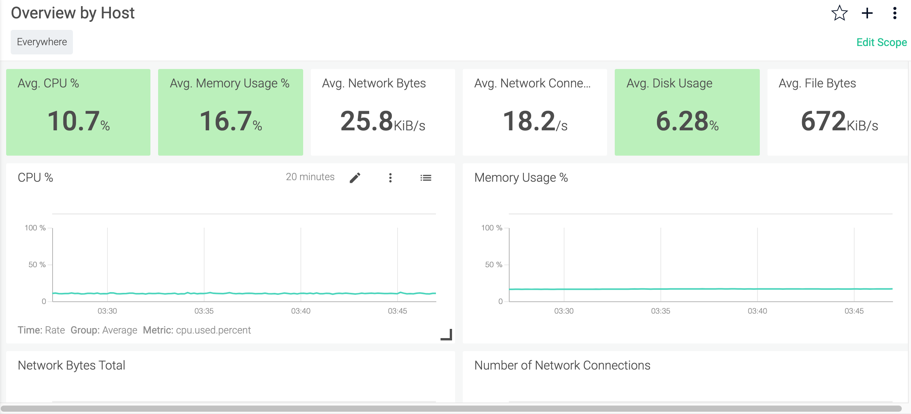
 
 
