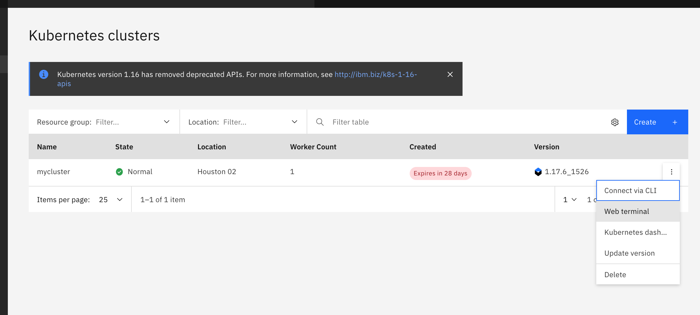
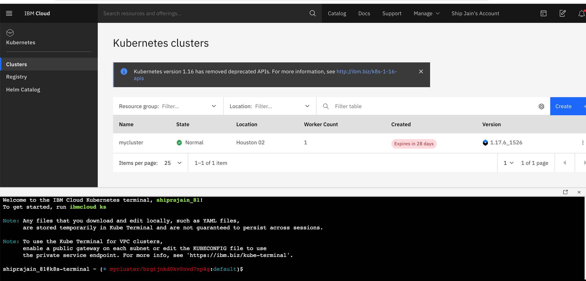
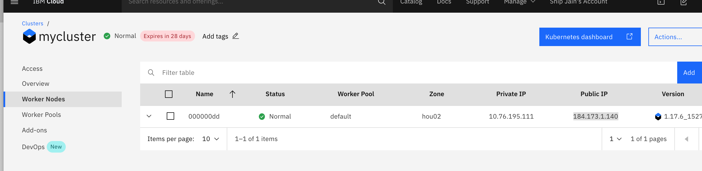
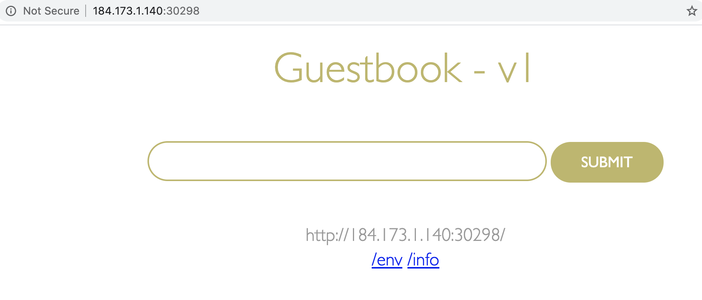
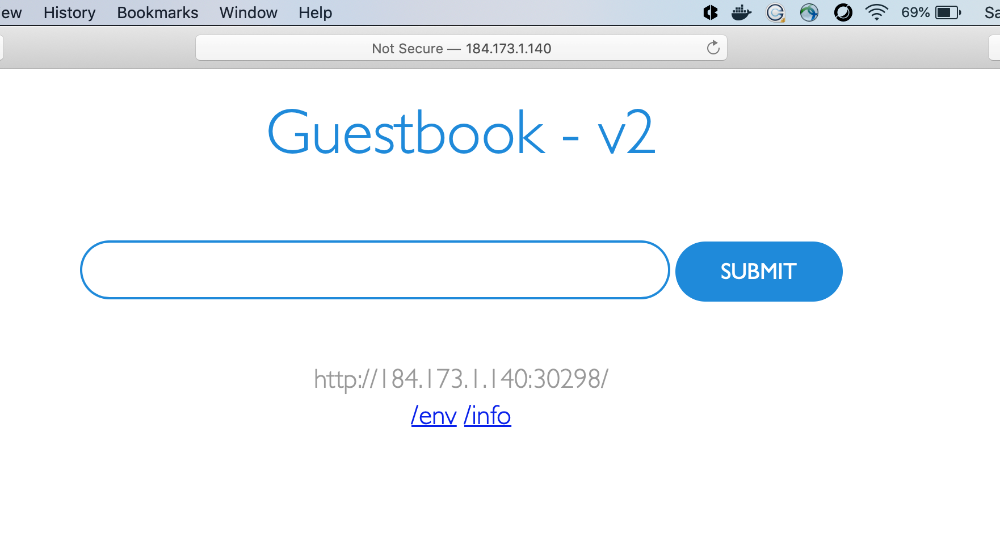

# Scalable Web Application on Kubernetes

## Objective
1. Deploy an application on Kubernetes
2. Scale and Update Deployments

## Pre-requisite
IBM Cloud Account
kubernetes cluster Provisioned
Good to have IBM Cloud CLI installtion

### Deploy an application on Kubernetes

#### Access Kubernetes Cluster using Web Terminal 
Go to Navigation Menu -> Kubernetes . From the 3 dots on the right side of mycluster , click on Web Terminal. 


     
#### Create the guestbook application deployment:
```kubectl create deployment guestbook --image=ibmcom/guestbook:v1```

check the status of the running application, you can use:
```kubectl get pods```

You should see similar output
```console
   $ kubectl get pods
   NAME                          READY     STATUS              RESTARTS   AGE
   guestbook-87b756bd5-5dxsr    0/1       ContainerCreating   0          1m
   ```
It will take some time to get this pod in running state
``` console
$ kubectl get pods
NAME                              READY   STATUS    RESTARTS   AGE
guestbook-87b756bd5-5dxsr         1/1     Running   0          112m
```
#### Expose the application 
Once the status reads Running, we need to expose that deployment as a Service so that it can be accessed from outside. By specifying a service type of NodePort, the service will also be mapped to a high-numbered port on each cluster node. The guestbook application listens on port 3000, so this is also specified in the command. Run:
```kubectl expose deployment guestbook --type="NodePort" --port=3000```
``` console 
$kubectl expose deployment guestbook --type="NodePort" --port=3000
service "guestbook" exposed
```
Check the service using command
``` kubectl get svc```

``` console
$ kubectl get svc
NAME         TYPE        CLUSTER-IP       EXTERNAL-IP   PORT(S)          AGE
guestbook    NodePort    172.21.156.20    <none>        3000:30298/TCP   101m
```

Guestbook application is exposed at port 30298 on public ip of cluster 

#### Access the guestbook app 

Find the public IP of the cluster 
use this command to get public if of your cluster
```ibmcloud ks workers -c <cluster name>```

```console
$ ibmcloud ks workers -c mycluster
OK
ID                                                     Public IP       Private IP      Flavor   State    Status   Zone    Version   
kube-brgtjnkd0kv0nvd7np4g-mycluster-default-000000dd   184.173.1.140   10.76.195.111   free     normal   Ready    hou02   1.17.6_1527   
```

You will get public IP os the cluster by checking the worker node tab on cluster home page. 




Access the page as http://<publicip>:<port>
  eg http://184.173.1.140:30298/
  


#### Scale the application
A replica is a copy of a pod that contains a running service. By having multiple replicas of a pod, you can ensure your deployment has the available resources to handle increasing load on your application.

To Scale the guestbook application use command 
```kubectl scale --replicas=10 deployment guestbook```

``` console
$ kubectl scale --replicas=10 deployment guestbook
deployment "guestbook" scaled
```
 Kubernetes will now try to match the desired state of 10 replicas by starting 9 new pods with the same configuration 
as the first.

   ```console
   $ kubectl rollout status deployment guestbook
	Waiting for rollout to finish: 1 of 10 updated replicas are available...
	Waiting for rollout to finish: 2 of 10 updated replicas are available...
	Waiting for rollout to finish: 3 of 10 updated replicas are available...
	Waiting for rollout to finish: 4 of 10 updated replicas are available...
	Waiting for rollout to finish: 5 of 10 updated replicas are available...
	Waiting for rollout to finish: 6 of 10 updated replicas are available...
	Waiting for rollout to finish: 7 of 10 updated replicas are available...
	Waiting for rollout to finish: 8 of 10 updated replicas are available...
	Waiting for rollout to finish: 9 of 10 updated replicas are available...
	deployment "guestbook" successfully rolled out
   ```
   
   ``` console
   $ kubectl rollout status deployment guestbook
deployment "guestbook" successfully rolled out
```
Check number of pods running by usig command 
``` kubectl get pods```

``` console
$ kubectl get pods
NAME                              READY   STATUS    RESTARTS   AGE
guestbook-87b756bd5-5dxsr         1/1     Running   0          138m
guestbook-87b756bd5-b9vfp         1/1     Running   0          61s
guestbook-87b756bd5-ftmxn         1/1     Running   0          61s
guestbook-87b756bd5-jwsqm         1/1     Running   0          61s
guestbook-87b756bd5-l46pv         1/1     Running   0          61s
guestbook-87b756bd5-q9gk9         1/1     Running   0          61s
guestbook-87b756bd5-vnw9t         1/1     Running   0          61s
guestbook-87b756bd5-vs56p         1/1     Running   0          61s
guestbook-87b756bd5-xtwck         1/1     Running   0          61s
guestbook-87b756bd5-zbqls         1/1     Running   0          61s

```
   
#### Kubernetes Update and rollback
Kubernetes allows you to do a rolling upgrade of your application to a new container image. Kubernetes allows you to easily update the running image but also allows you to easily undo a rollout if a problem is discovered during or after deployment.

In the previous lab, we used an image with a v1 tag. For our upgrade, we'll use the image with the v2 tag.

Using kubectl, you can now update your deployment to use the v2 image. kubectl allows you to change details about existing resources with the set subcommand. We can use it to change the image being used.

```kubectl set image deployment/guestbook guestbook=ibmcom/guestbook:v2```
``` console
 kubectl set image deployment/guestbook guestbook=ibmcom/guestbook:v2
deployment.apps/guestbook image updated
```
Check Rollout status using command
``` kubectl rollout status deployment/guestbook```

```console
$  kubectl rollout status deployment/guestbook
deployment "guestbook" successfully rolled out
```
Test the application as before, by accessing <public-IP>:<nodeport> (use the same as the previous lab) in the browser to confirm your new code is active.
 

  
#### rollback your application
use command rollback to , rollback the deplyment at previous version 

``` console
 kubectl rollout undo deployment guestbook
deployment.apps/guestbook rolled back
```

check the pod status using 
``` kubectl get pods```
``` console
$ kubectl get pods
NAME                              READY   STATUS        RESTARTS   AGE
guestbook-87b756bd5-4whpb         1/1     Running       0          13s
guestbook-87b756bd5-b6h6x         1/1     Running       0          13s
guestbook-87b756bd5-crh72         1/1     Running       0          9s
guestbook-87b756bd5-czjs2         1/1     Running       0          10s
guestbook-87b756bd5-dsv88         1/1     Running       0          13s
guestbook-87b756bd5-mh7xc         1/1     Running       0          13s
guestbook-87b756bd5-n2zt6         1/1     Running       0          9s
guestbook-87b756bd5-p9tbh         1/1     Running       0          13s
guestbook-87b756bd5-vmc6x         1/1     Running       0          9s
guestbook-87b756bd5-whhr8         1/1     Running       0          10s
guestbook-df976f65b-4lsgr         0/1     Terminating   0          10m
guestbook-df976f65b-82jd6         0/1     Terminating   0          10m
guestbook-df976f65b-gkf62         0/1     Terminating   0          10m
guestbook-df976f65b-jv9v7         0/1     Terminating   0          10m
guestbook-df976f65b-pf98c         0/1     Terminating   0          10m
guestbook-df976f65b-vsrfk         0/1     Terminating   0          10m
guestbook-df976f65b-x2mc7         0/1     Terminating   0          10m
guestbook-df976f65b-xxpsx         0/1     Terminating   0          10m
guestbook-df976f65b-z7tm9         0/1     Terminating   0          10m
load-generator-5fb4fb465b-rzsj2   1/1     Running       0          77m
logdna-agent-cjhjl                1/1     Running       0          47h
php-apache-79544c9bd9-cphmx       1/1     Running       0          78m
```

Check the broser again , you will see that you again get guestbook V1 app in your browser


#### Clean up
Before we continue, let's delete the application so we can learn about a different way to achieve the same results by using resource files instead of providing command line options.
To remove the deployment, use:

``` kubectl delete deployment guestbook```

To delete the service use

```  kubectl delete service guestbook```
