# Migrating Cloud Foundry applications to IBM Kubernetes Service

This exercise describes using the migration tool to migrate each of the following example applications to IBM Kubernetes Service:

- Java hello-world application using the `ibm-websphere-liberty` buildpack, and requiring some backend services. The source code is pulled from a local directory.
- Different Java hello-world application using the `ibm-websphere-liberty` buildpack and no backend services. The source code is pulled from a github repository.
- Simple Java Spring Boot application using the `java` (Tomcat) buildpack and no backend services. The source code is pulled from a github repository.
- Simple Node.js hello-world application using the `nodejs` buildpack and no backend services. The source code is pulled from a github repository.
- Node.js application using the `nodejs` buildpack and requiring a Cloudant database backend service. The source code is pulled from a github repository.

The migration tool is run from a Docker container. The migration tool Docker container is provided so you can run the tool without having to install all the prerequisite software on your own system.

In the beginning of the exercise, you deploy the application to a Cloud Foundry platform. The instructions in this exercise use the IBM Cloud Public Cloud Foundry platform for convenience, but the tool is designed to work with Pivotal or any other Cloud Foundry platform.

The applications are deployed to Cloud Foundry for two purposes:

- To validate that the application **does** actually run in Cloud Foundry
- To extract the credentials for any backend services used by the application in the VCAP_SERVICES environment variable. As part of the migration, these credentials are used to create a Kubernetes secret, to allow the same backend services to be accessed by the application running on the target Kubernetes platform (OpenShift or IBM Kubernetes Service on IBM Cloud Public).

You should be able to use any application that can be deployed to Cloud Foundry to do these exercises. By running through the steps with the example applications provided here, you will acquire the skills to use the tool with other Cloud Foundry applications.

## Liberty hello-world application accessed from downloaded `exemplar` sub-directory

In this first example, you migrate an application that runs on WebSphere Liberty in Cloud Foundry. This application has a dependency on several custom user-provided services. The migration task is divided into several stages which are listed below.

- Preparing the migration environment
- Testing the application on Cloud Foundry
- Running the migration tool and deploying the application to IBM Kubernetes Service

### Preparing the migration environment

You run these preparation steps only once. There is no need to redo these steps for subsequent lab exercises:

1. Run the provided Docker container. You should have Docker installed and running on your system. Specify an empty local directory path to be used as the conversion working directory. The following command connects you to a bash shell inside the migration tool container.

		docker run -p 8000:8000 -v <your_local_path>:/data -v /var/run/docker.sock:/var/run/docker.sock -it ibmcloudacademy/cfmigrationtool bash

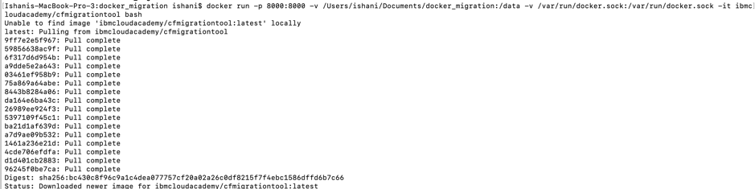

This step may take 15-20 minutes, depending on the interenet connectivity too. So wait for it to be completed.

2. From the bash shell of the Docker container, clone the repository containing the migration tool and sample application code:

		git clone https://github.com/ibm-cloud-architecture/cf-transformation

	The result is that you have a `/cf-transformation` directory that contains the conversion code.

### Testing the application on the Cloud Foundry environment

As mentioned at the beginning of the exercise, you deploy the application to Cloud Foundry. This stage verifies that the application actually runs and allows you to collect the VCAP_SERVICES environment variable contents for the application's backend services.

1. Go to the example application code directory:

		cd cf-transformation/exemplar/hello-world
	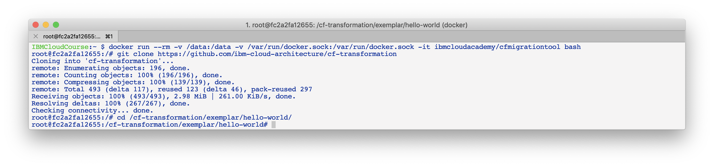

2. Login and deploy the application to Cloud Foundry. For this exercise, we use Cloud Foundry on IBM Cloud Public for convenience. However, you should be able to perform the Cloud Foundry steps on any Cloud Foundry environment. To that end, we will use the generic `cf` commands in these instructions rather than the equivalent `ibmcloud` versions of those commands. The only exception is for the initial login to IBM Cloud Public.

   - You will be prompted for your user id, password, and region for login. This step is only performed if you are using IBM Cloud Public.

			ibmcloud login
			ibmcloud target --cf

	  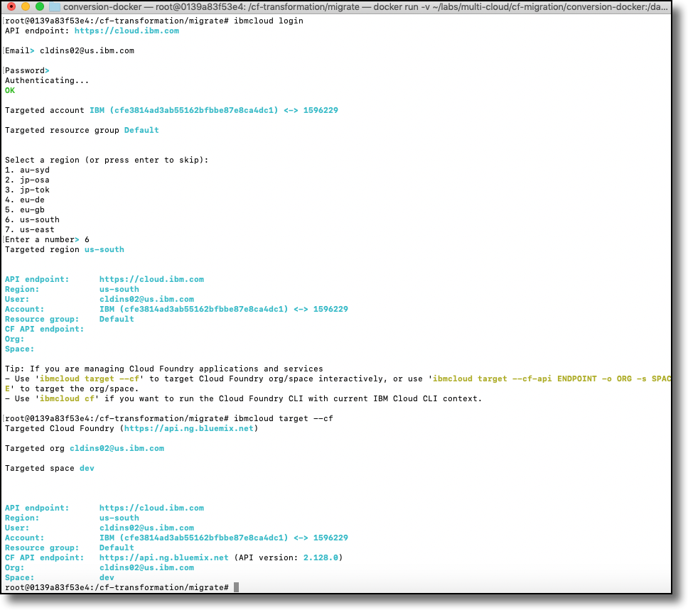

	- Take note of the *CF API Endpont* returned by the `ibmcloud target --cf` command. You will need this for your standard Cloud Foundry login. If you are using the US South region, your CF API Endpoint will be `https://api.ng.bluemix.net`.
	- Login to Cloud Foundry. By logging in to Cloud Foundry, you are able to use the standard `cf` commands, the same commands as you would use for Pivotal or other non-IBM Cloud Foundry platforms. Use the same user id and password.

			cf login

	 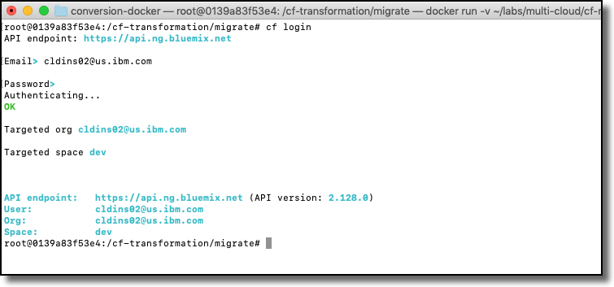

Go into the folder of your container `/cf-transformation/migrate`

	- Build the application using Maven. Create the User Provided Services ups1, ups2 and ups3. You should substitute your first and last name for the ups1 and ups2 values. The ups3 service value is not displayed by the application but you can populate it with any value.
	- Substitute your initials for the `jc` in the `cf push` command. Your application name and route must be unique.

			mvn clean install
			cf cups ups1 -p '{ "key1": "Joe " }'
			cf cups ups2 -p '{ "key2": "Cool" }'
			cf cups ups3 -p '{ "key3": "Sir" }'
			cf push jc-hello-world -n jc-hello-world

	 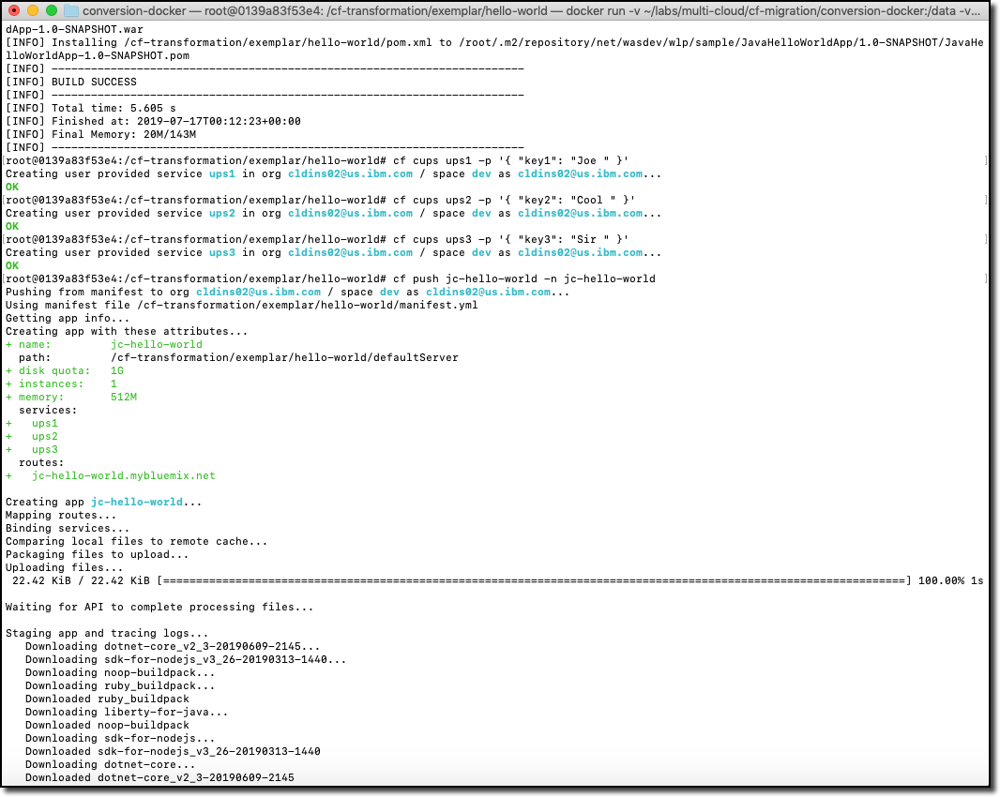
	 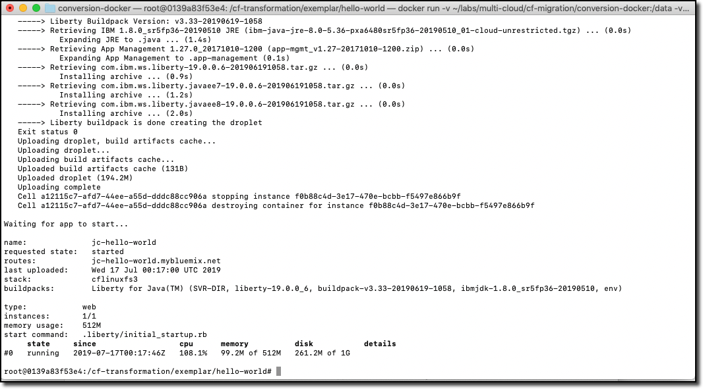

3. Test your application to see whether it is running on Cloud Foundry. Go to the URL `http://jc-hello-world.mybluemix.net`, substituting your initials for `jc`. You should see the following screen, with your name displayed:    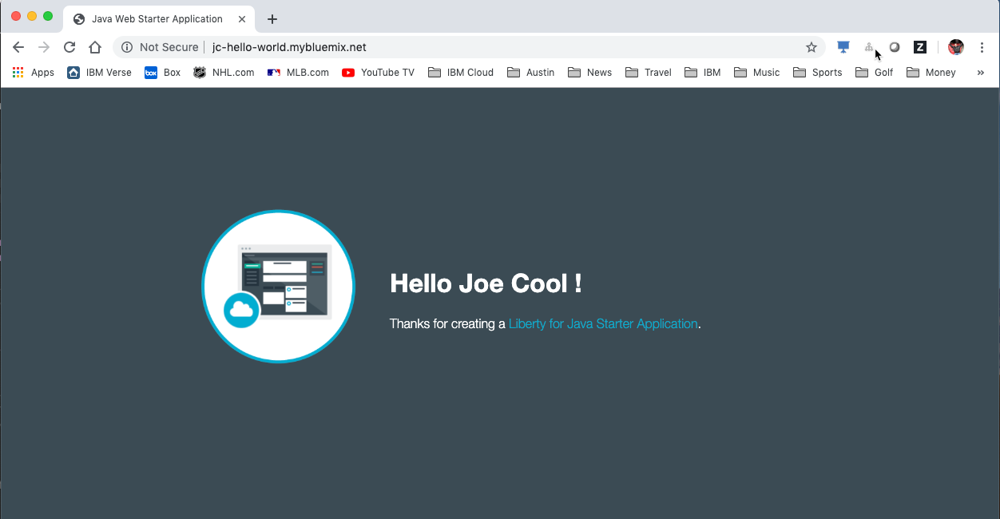

4. Now that the application is running, you should see that it is getting the values for your first and last name from the Custom User Provided Services (cups) you created and populated in the previous commands.

5. Go to the migration tool path:

		cd /cf-transformation/migrate

6. Retrieve the application's VCAP_SERVICES variables and put them in the `vcap.json` file.

		cf env jc-hello-world | awk '/VCAP_SERVICES/{flag=1} /^}/{flag=0} flag' | sed 's/"VCAP_SERVICES"://' > vcap.json
		cat vcap.json

   The output should be similar to the following:  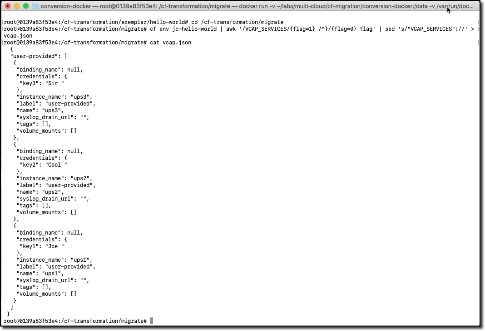

### Running the migration tool and deploying the application to IBM Kubernetes Service

The last stage of the migration is performed for the specific target environment.

1. Run the migration command:

		./cf-migrate.sh -s /cf-transformation/exemplar/hello-world -t /data/cfliberty1 -e iks -b ibm-websphere-liberty

	The output should be similar to the following:  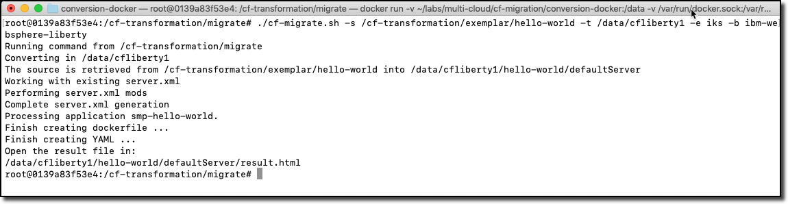

2. Open the generated `result.html` file using a Web browser (remember the path mapping that you did in the first step of preparing the environment). The `result.html` file will be in the subdirectory `cfliberty1/hello-world/defaultServer`.  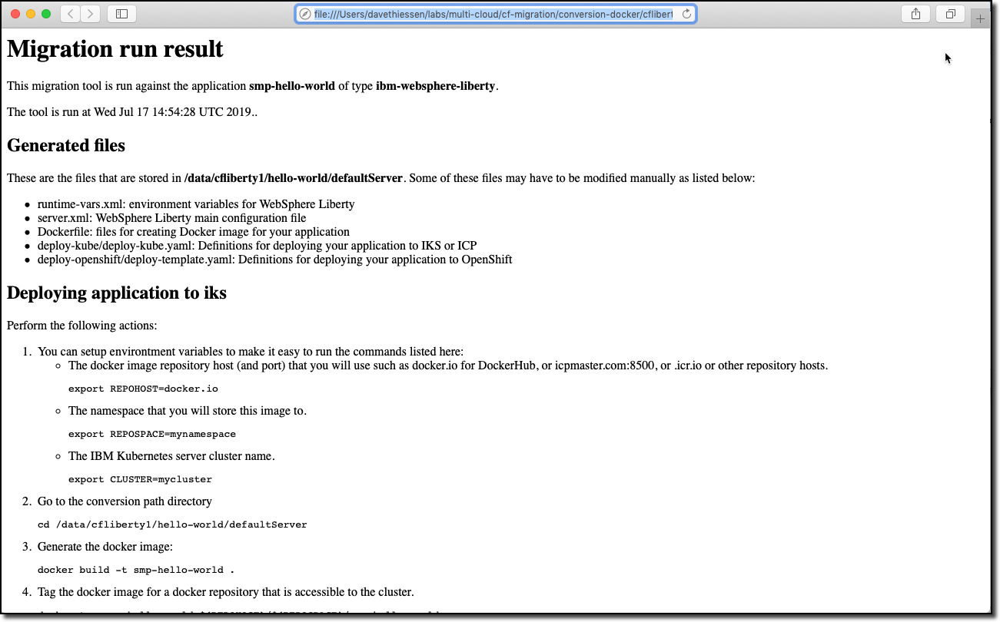

10. Go directly to the section **Deploying application to iks** and perform the step-by-step instructions there. Note that you must specify the following values:

	- Repository host (REPOHOST). You can use `docker.io` to use DockerHub or use `icr.io` for IBM Cloud registry.
	- Namespace (REPOSPACE). Your namespace (in DockerHub, it is similar to your userID) that you define in the repository.
	- Kubernetes cluster name (CLUSTER)

	Note that for login to the IBM Kubernetes Services cluster using the `ibmcloud login` command, you may be asked to get an SSO login token. The commands that are listed in steps 2 and later are using the environment variables that are set above. If you have defined these environment variables, you should be able to run the commands as-is, directly cut-and-pasted from the `result.html` browser page to the bash prompt of the cfmigrationtool container.

	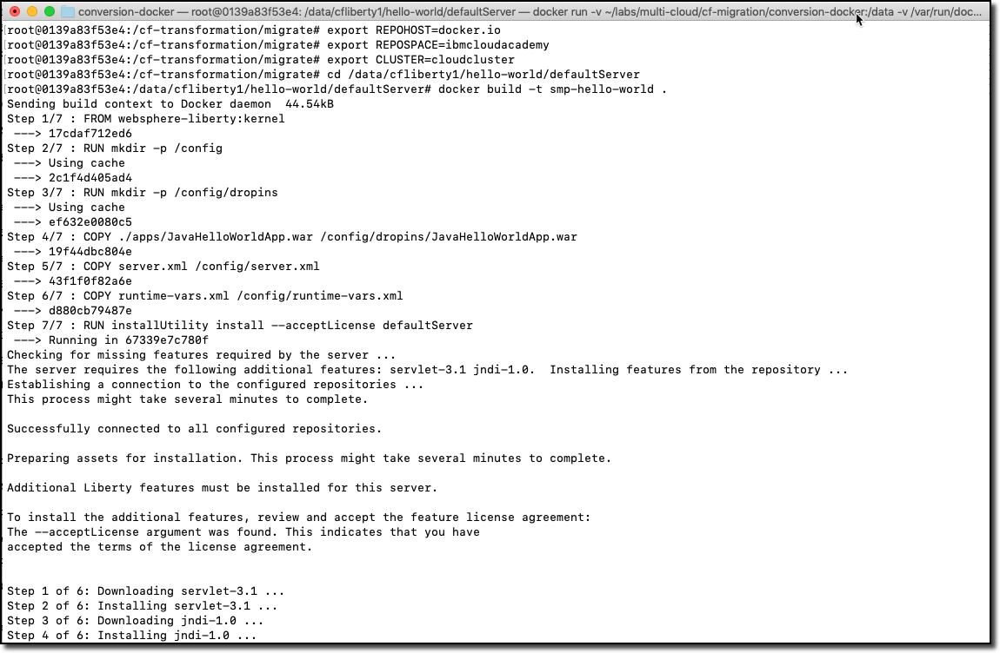
	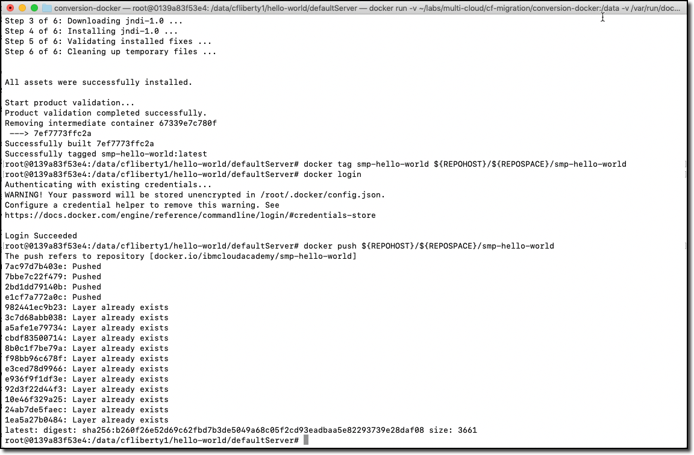
	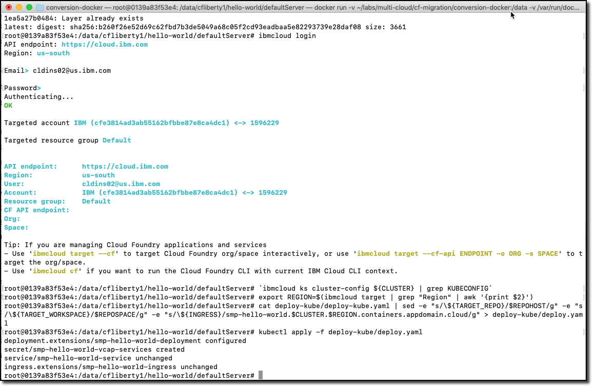
NOTE: `docker push ${REPOHOST}/${REPOSPACE}/smp-hello-world` takes time around 10-15 minutes, depending on the internet connectivity. So wait for it to be completed.

4. Once the migration is completed, depending on the Kubernetes cluster type (Free or Paid cluster), collect the target route as follows (you must do the same thing for each of the other scenarios below):

	- For free cluster, use the Worker Node public IP and NodePort, run `ibmcloud ks workers --cluster $CLUSTER` and `kubectl get service`
	- For a paid cluster, the target route should be: `<APPLNAME>.<CLUSTER>.<REGION>.containers.appdomain.cloud`

	Open a browser window to `http://<routehost>/JavaHelloWorldApp`. The result should be similar to the one you had for the application on Cloud Foundry.  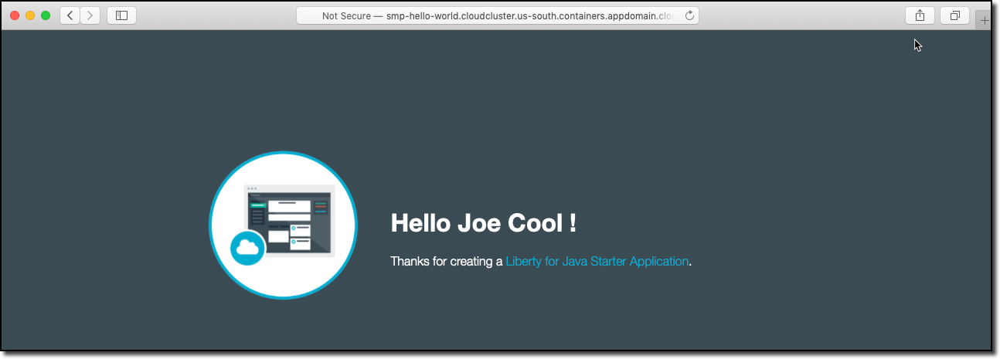

