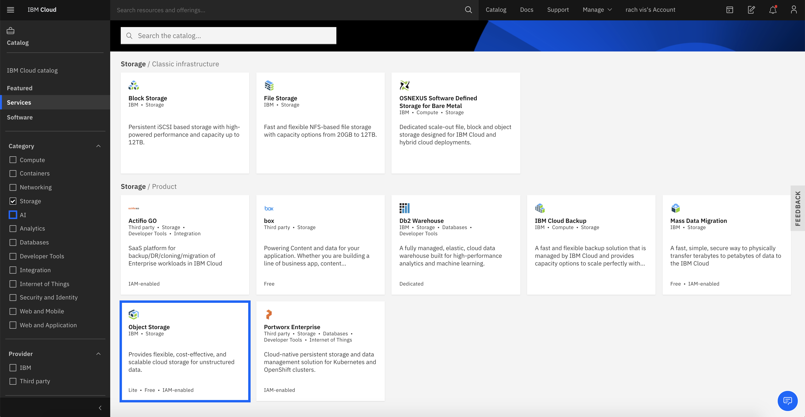

## Watson Openscale MRM - Model Risk Management

### Flow of workshop


### Provision Services

1. Go to cloud catalog, filter the services by AI, provision Watson Studio, Watson Openscale and Watson Machine Learning instances.
NOTE: Make sure you are provisioning Watson Machine Learning service in Dallas data center since openscale is available there.


2. Go to cloud catalog, filter the services by storage, provision an instance of Cloud Object Storage.



3. To access these resources, use the navigation menu from top left corner and click on resource list.


### WML Credentials

1. From the resource list, launch openscale. Click on ```Add machine learning provider``` and configure the wml instance that you have provisioned.


2. Open the configured wml instance and copy the service credentials.


### Run notebooks and deploy them using WML

1. From resource list, open the instance of Watson Studio that has just been provisioned and click on ```Get Started```. From the landing page of watson studio, click on create a project.


2. Then choose empty project.


3. Ensure that the object storage is bounded to your project instance on Watson studio, if not create a cos instance and reload. Then click on ```create```


4. Within watson studio project - from the right corner, click on ```Add to project``` and select ```Notebook```


5. We will have to run two notebooks on Watson Studio - GermanCreditRisk_v1_spark_MRM_Test.ipynb and GermanCreditRisk_v2_scikit_MRM_PreProd.ipynb
These files will be provided to you prior to the workshop, either download them and import them using ```from file``` option on watson studio or provide the git url of .ipynb files from  ```from url``` option on watson studio. Upload ```GermanCreditRisk_v1_spark_MRM_Test.ipynb``` and ensure you have given ```Spark 2.3 with Python 3.6``` env. Click on ```Create```.


6. Once the notebook opens up, there is one column that asks for wml credentials. Paste the copied credentials here and run the notebook.


7. Upload ```GermanCreditRisk_v2_scikit_MRM_PreProd.ipynb``` and ensure you have given ```Default Python 3.6``` env. Click on ```Create```. Similarly add the wml credentials that are copied in the notebook and run the notebook.


8. Once these notebooks are run, two models will be deployed using your watson machine learning instance.


### Add data in Cloud-Object-Storage

1. Open cloud object storage instance from ```Resource list```.
Buckets -> openscaledbs-donotdelete..... You will be able to see the notebooks that you have imported on Watson Studio.

2. Add ```german_credit_data_biased_training.csv``` dataset to the cos bucket.


3. After adding the dataset to the cos bucket, go to endpoint from the left side of the screen and adjust the region and copy it for later use.


4. Go to service credentials and create a new set of credentials and copy ```apikey``` and ```resource_instance_id```.


### Monitor the models on Openscale

1. Launch Openscale service from ```Resource list```, configure WML details and click on ```Add Dashboard```.


2. Select the first model ```German Credit Risk Model - Test``` and click on ```Configure```


3. Click on ```Configure Monittors``` to provide the metadata of the model that we deployed using watson machine learning.


4. Add model details as shown in the following, click ```Save and Continue```.


5. Add the details of cos bucket that we have stored in the earlier steps and click on ```connect```.


6. Paste the details of cos bucket that you have copied in the previous steps and connect to training data from watson openscale.


7. Execute the scoring cell from notebook and select automatic logging, then click next.


8. Adjust the Favourable outcomes, sample size, fairness to evaluate as shown.


9. Adjust the quality treshold to 0.8 and sample size to Minimum 100 and Maximum 10,000.


10. Adjust the drift treshold to 10%, sample size to 100. This will take some time to run.


11. Once this is done, add the ```german_credit_data_biased_test_2.csv``` to evaluate the model. Upload the dataset and click on ```Upload and evaluate now```.


Once the upload is done, you will get the model monitors with various tests.


12. Similarly, create the model monitor for the other model as well. Once you create model monitors for both the models that you have deployed using Watson Machine Learning, it will look something like the following.


13. Open one of the models, from the right corner click on ```compare``` and select a model that you to compare this with.


14. Additional features like how to download model report can also be performed using the options provided in ```Actions``` within model monitor on Watson Openscale.


### HAPPY CODING!!!
